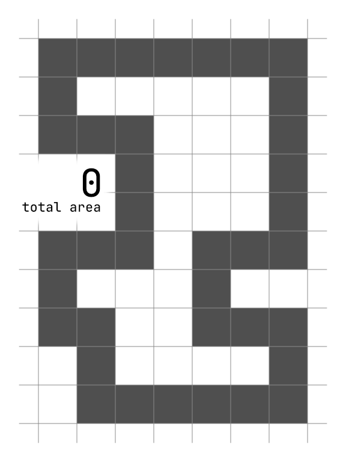

Pretty easy part 1, though it was kind of inelegant and slow with a bunch of crawling. I've since removed that code after doing part 2.

Part 2 made crawling impossible, and I had a very hard time coming up with a strategy to handle it.

It turns out there's something called the shoelace formula, and you can use it to calculate the area of any polygon given its vertex coordinates. That sure sounds easy!

I eventually came up with a strategy that can be pictured as waterfalls pouring down the puzzle shape. Every horizontal line encountered alters the waterfalls, either adding or removing segments, and the calculated area for the previous falls is added to the total.

A lot of iteration went into reaching this final approach. I was doing all kinds of complex intersection and segment splitting that ended up being unnecessary. Turns out that storing the segments as just a flat list of stop and stop numbers lets you handle the transformations with a really simple method.

So I'm really satisfied to have come up with and implemented my own algorithm despite it taking a while. I'm sure I would have reached for the shoelace formula if I knew about it, but I'm glad I didn't in retrospect.

Rank #4984

Here's a basic visualization of this approach:

